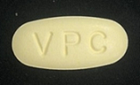

# Gabor Filter

Yu CC, Wen CY, Lu CP and Chen YF, “*The Drug Tablet Image Retrieval System Based on Content-Based Image Retrieval*,” International Journal of Innovative Computing, Information and Control(IJICIC), Volume 8, Number 7(A), July 2012.

[PDF download](http://www.ijicic.org/ijicic-11-03080.pdf)

This method is used to the procedure of **Imprint mark feature extraction**.

You should installed the **Visual Studio 2015** (VC++) and **OpenCV** (v3.4.10)...

The drug photo demo here.

